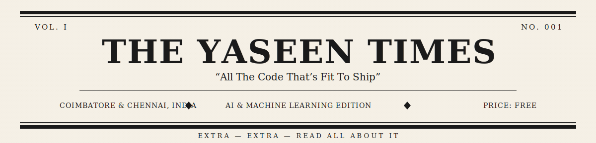
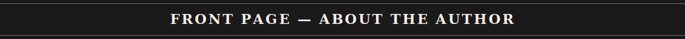
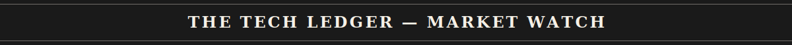
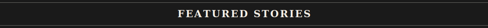
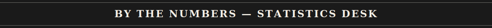
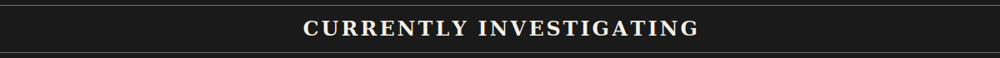
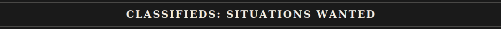
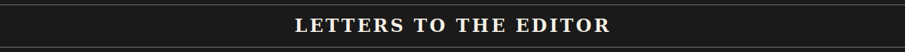
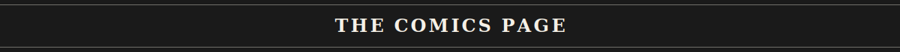

 

 

📰 DAILY CIRCULATION
 

 

<table>
<tr>
<td width="62%" valign="top">

**By Mohameed Yaseen M** &nbsp;|&nbsp; *Staff Correspondent, Technology Desk*

> Our correspondent, a third-year B.E. Computer Science (AI &amp; ML) student, has spent the better part of this year embedded deep within the world of Generative AI, Agentic Systems, and Full Stack Development.

**THE SHORT VERSION:**
- 🎓 B.E. CSE (Artificial Intelligence &amp; Machine Learning), Class of 2027
- 🏗️ Builds intelligent systems where Generative AI meets real product engineering
- 🎯 Actively seeking a placement as an **AI Engineer / Data Scientist**

<b>📖 Continued on Page 2 — click to read the full profile</b>

 

- 🔬 Currently investigating RAG pipelines, LLM fine-tuning, and Multi-Agent Systems
- 🖋️ Also the editor behind *"The Yaseen Times"* — a vintage newspaper-themed portfolio site, currently in production
- 💡 Driven by curiosity, sharp problem-solving instincts, and a genuine love for shipping things that work
- ⚡ Always chasing the newest tools, frameworks, and ideas at the edge of applied AI
- ✉️ Letters and inquiries about LLMs, RAG systems, or GenAI product builds are always welcome

<i>— End of story. Thank you for reading The Yaseen Times.</i>

</td>
<td width="38%" valign="top" align="center">

<i>Fig. 1 — At the news desk</i>

</td>
</tr>
</table>

---

<b>LANGUAGES DESK</b>

 

<b>LIBRARIES &amp; FRAMEWORKS</b>

 

<b>AI &amp; INTELLIGENCE BUREAU</b>

 

<b>RECORDS &amp; ARCHIVES (DATABASES)</b>

 

<b>DISTRIBUTION &amp; PRINTING (CLOUD/DEVOPS)</b>

 

<b>THE PRESSROOM (TOOLS)</b>

 

---

<table>
<tr>
<td width="50%" valign="top">

### 📰 LinkedStory
#### *Local Developer Builds AI Storytelling Engine*
*By Staff Reporter — Technology Bureau*

An AI-driven platform that transforms raw ideas into compelling narrative content, built for creators and professionals looking to grow their personal brand online.

<b>Continued on Page 4 ➤</b>

 

**Filed under:** Next.js · LLM API · OAuth · Vector Search

**[📖 LIVE EDITION](https://linked-story.vercel.app/)** &nbsp;·&nbsp; **[🗄️ SOURCE ARCHIVE](https://github.com/Yaseen120821/Linked_Story)**

</td>
<td width="50%" valign="top">

### 📰 Admission ChatBot
#### *Campus Debuts Round-The-Clock AI Answer Desk*
*By Staff Reporter — Campus Bureau*

A Retrieval-Augmented Generation chatbot that retrieves relevant knowledge from a custom document store before generating grounded, accurate answers to student queries.

<b>Continued on Page 4 ➤</b>

 

**Filed under:** Node.js · Gemini API · Cosine Similarity · RAG

**[🗄️ SOURCE ARCHIVE](https://github.com/Yaseen120821/Admission-ChatBot)**

</td>
</tr>
<tr>
<td width="100%" colspan="2" valign="top">

### 📰 LLM Applications
#### *Wire Report: A Growing Dossier of Language Model Experiments*
*By Staff Reporter — Research Desk*

A continuously expanding collection of applied Large Language Model projects — exploring prompting strategies, tool use, agentic workflows, and multi-model orchestration.

<b>Continued on Page 4 ➤</b>

 

**Filed under:** Python · OpenAI / Claude / NVIDIA NIM · Agentic Workflows

**[🗄️ SOURCE ARCHIVE](#)** &nbsp;*(link pending — send us the repo, Chief)*

</td>
</tr>
</table>

---

<b>🐍 THE SERPENT COLUMN — click to reveal today's contribution snake</b>

 

 
Requires a small GitHub Action on your profile repo — ask if you'd like that workflow file.

---

---

> **SITUATIONS WANTED — AI ENGINEER / DATA SCIENTIST**
> Diligent B.E. CSE (AI &amp; ML) graduate-to-be (Class of 2027) seeks placement at a company building real-world AI products. References available upon request. **Inquire within.**

<table align="center">
<tr>
<td align="center">🚀 <b>Multiple AI Projects</b> Shipped end-to-end</td>
<td align="center">🧩 <b>DSA Practice</b> Consistent LeetCode solving in Java</td>
<td align="center">🎓 <b>B.E. CSE (AI &amp; ML)</b> Class of 2027</td>
<td align="center">🌐 <b>Full Stack + AI</b> End-to-end product builder</td>
</tr>
</table>

<b>🏅 Certifications &amp; Credentials on File — click to view</b>

 

- 🏅 [Certification Name] — [Issuing Organization]
- 🏅 [Certification Name] — [Issuing Organization]
- 🏅 [Certification Name] — [Issuing Organization]

---

*Correspondence, tips, and job offers may be directed to the editorial desk below.*

---

<b>💻 Today's Strip — click to reveal</b>

 

 

<b>🔮 Tech Horoscope — click for today's forecast</b>

 

*The stars (and the compiler) suggest: a clean build is coming, but only after one more semicolon hunt. Favorable hours for debugging: late night. Lucky number: 200 (as in status code).*

 

☕ Coffees consumed on deadline: `∞`
 
🌙 Preferred press time: `2:00 AM`
 
🧠 Currently obsessed with: `Agentic AI workflows`

---

*If you enjoyed this edition, consider a subscription — starring the repositories above keeps this paper in print.*
 

  

  

**— END OF EDITION —**
 
🗞️ © 2026 The Yaseen Times &nbsp;·&nbsp; All Rights Reserved (except the open source parts)

